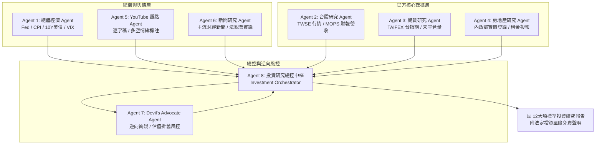

# AI 智慧投資研究中心 (AI Investment Research Agent)

<div align="center">


### 多 Agent 官方資料驗證 ‧ Devil's Advocate 逆向質疑風控 ‧ 深度金融研究平台

[](https://github.com/n9694151/Finance-20260918/actions/workflows/deploy.yml)
[](https://nodejs.org/)
[](https://react.dev/)
[](https://www.typescriptlang.org/)
[](https://vitejs.dev/)
[](https://tailwindcss.com/)

</div>

---

## 📌 專案核心理念與產品定位

**「AI 智慧投資研究中心」**並非單純的選股推薦或炒短線聊天機器人，而是一套嚴謹的金融資料交叉比對與多層級推論中樞。

> **核心原則：**
> 1. **AI 不替投資人決定買賣，而是負責將資料蒐集、驗證、計算、交叉比對做好。**
> 2. **嚴格隔離「FACT 事實資料」、「SOURCE 來源」、「ANALYSIS AI分析」、「INFERENCE 推論」與「RISK 風險質疑」。**
> 3. **導入「Devil's Advocate 逆向風控 Agent」：強迫質疑主流樂觀論點、海外折舊與估值泡沫風險。**

---

## 🏛️ 多 Agent 協同研究架構



---

## 🛠️ 技術堆疊 (Tech Stack)

| 領域 | 核心技術 / 套件 | 說明 |
| :--- | :--- | :--- |
| **前端框架** | React 19 (`react`, `react-dom`) | 最新穩定版本，極致的渲染效能與型別安全 |
| **程式語言** | TypeScript 5.8 | 嚴格模式 (`strict: true`)，完整定義金融數據結構 |
| **建構工具** | Vite 6 (`@vitejs/plugin-react`) | 快速熱重載 (HMR) 與生產環境最佳化打包 |
| **樣式庫** | Tailwind CSS v4 (`@tailwindcss/vite`) | 最新 v4 架構，專屬深色金融終端機與玻璃擬態視覺 |
| **圖標庫** | Lucide React (`lucide-react`) | 簡約且高度一致之金融、趨勢與系統圖標 |
| **自動化部署**| GitHub Actions (`actions/deploy-pages@v4`) | 一鍵編譯驗證並發布至 GitHub Pages |

---

## 🚀 快速上手 (Quick Start)

### 1. 環境需求
- **Node.js**：`>= 18.0.0`（建議使用 **Node 20 或 Node 22**）
- **npm**：`>= 9.0.0`

### 2. 安裝相依套件
在終端機進入專案目錄後執行：
```bash
npm install
```
> 💡 **Windows 用戶提示**：若在 PowerShell 遇到 `npm.ps1 cannot be loaded` 執行原則限制，請改用 `npm.cmd install` 或以管理員權限執行 `Set-ExecutionPolicy -Scope Process -ExecutionPolicy Bypass`。

### 3. 啟動本機開發伺服器
```bash
npm run dev
```
啟動後於瀏覽器開啟：`http://localhost:5173/`。

### 4. 執行 TypeScript 型別檢查
```bash
npm run typecheck
```

### 5. 建構生產環境靜態產物
```bash
npm run build:client
```
打包檔案將生成於 `./dist` 目錄。

### 6. 預覽生產建構產物
```bash
npm run preview
```

---

## 🌐 GitHub Actions 自動化部署上線指南

本專案已配置完整之 GitHub Actions 工作流：[`.github/workflows/deploy.yml`](.github/workflows/deploy.yml)，任何程式碼推送至 `main` 分支均會自動建置並發布至 **GitHub Pages**。

### 第一次部署設定步驟：

1. **進入您的 GitHub 專案儲存庫**：
   `https://github.com/n9694151/Finance-20260918`
2. **前往設定 (Settings)**：
   點擊右上角的 `Settings` 標籤頁。
3. **設定 GitHub Pages 來源 (Pages Source)**：
   - 點擊左側選單的 **`Pages`**。
   - 在 **`Build and deployment`** 區塊中的 **`Source`** 下拉選單中，選擇 **`GitHub Actions`**。
4. **觸發自動部署**：
   - **方式 A (自動觸發)**：只需執行 `git push origin main`，工作流將自動啟動。
   - **方式 B (手動觸發)**：在 GitHub 頁面點擊 **`Actions`** 標籤頁 -> 選擇 **`Deploy Finance AI Agent to GitHub Pages`** -> 點擊右側 **`Run workflow`**。
5. **瀏覽上線網站**：
   部署完成後（約 1-2 分鐘），即可透過 GitHub 分配的網址連線訪問：
   `https://n9694151.github.io/Finance-20260918/`

---

## 📂 專案目錄結構

```text
Finance-20260918/
├── .github/
│   └── workflows/
│       └── deploy.yml          # GitHub Actions 自動部署工作流
├── src/
│   ├── components/
│   │   ├── Header.tsx                 # 頂部導覽列與即時連線指標
│   │   ├── Sidebar.tsx                # 左側功能切換導覽 (8大 Agent 模組)
│   │   ├── MarketTicker.tsx           # 市場行情指數橫向跑馬列
│   │   ├── ResearchAgentProgress.tsx  # 多 Agent 協同步驟動畫進度條
│   │   └── ResearchReportView.tsx     # 12 大項標準投資研究報告檢視器
│   ├── mock/
│   │   └── financeData.ts      # TWSE / MOPS 核心金融數據與反方風控模擬庫
│   ├── types/
│   │   └── index.ts            # 嚴謹的金融型別定義 (Fact/Inference/Quotes)
│   ├── App.tsx                 # 主應用程式介面與多 Agent 協同排程
│   ├── main.tsx                # React 19 掛載入口
│   └── index.css               # Tailwind CSS v4 與金融暗黑主題樣式
├── .env.example                # 環境設定檔範本
├── .gitignore                  # 依賴、暫存與隱私金鑰過濾規則
├── index.html                  # HTML 5 頁面範本
├── package.json                # 專案依賴與腳本定義
├── tsconfig.json               # TypeScript 編譯設定
├── vite.config.ts              # Vite 6 與 GitHub Pages 相對路徑設定
└── README.md                   # 專案完整操作手冊
```

---

## 🛡️ 資料層級與事實隔離準則

為避免一般 AI 機器人「一本正經胡說八道」的幻覺問題，本系統制定了 6 級資料可信度架構：

| 級別 | 資料來源 | 系統權重 | 說明 |
| :--- | :--- | :---: | :--- |
| **Level 1** | 臺灣證券交易所 (TWSE)、期交所 (TAIFEX) 官方數據 | 100% | 不得竄改，作為唯一合法價格與籌碼事實 |
| **Level 2** | 公開資訊觀測站 (MOPS) 正式財報與月營收公告 | 100% | 營收年增率 (YoY)、每季 EPS 之最高權威依據 |
| **Level 3** | 主流財經媒體、法說會簡報實錄 | 80% | 作為產業趨勢與指引輔助資料 |
| **Level 4** | 專業券商與調研機構報告 | 70% | 歷史預估與同業估值比對參考 |
| **Level 5** | YouTube 影片、財經網紅觀點、Podcast | 30% | **僅萃取為「市場情緒」，絕對不得作為事實依據** |
| **Level 6** | AI 推論與 Devil's Advocate 逆向質疑 | - | 明確標示 `[INFERENCE]` 或 `[RISK]`，禁止偽裝事實 |

---

## ⚖️ 法定投資風險免責聲明

> **【重要警語】**
> 本專案系統所提供之所有資料整理、交叉比對、AI 研究報告、產業論點與 Devil's Advocate 逆向風險質疑，僅供個人研究、學術探討與決策輔助用途，**絕不構成任何形式之投資建議、買賣推薦、獲利保證或邀約**。
> 金融市場與槓桿衍生性商品具有高度波動性與本金損失風險，投資人應獨立思考，依據自身財務狀況與風險承受度進行判斷，並自行承擔所有投資決策之後果與損益。

---

## 👨‍💻 維護與授權

- 專案維護：資深 React 金融架構工程團隊
- 授權條款：MIT License
